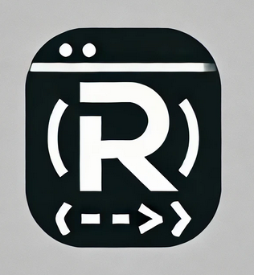
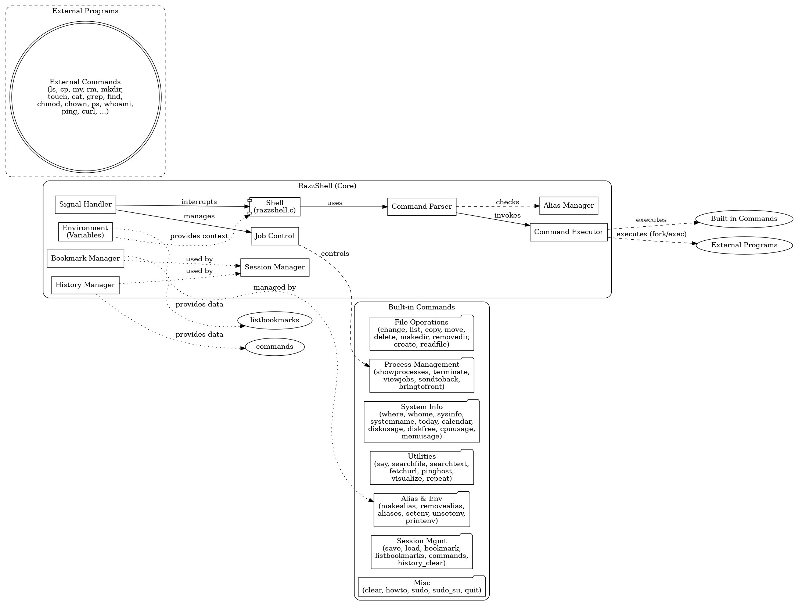

# RazzShell

RazzShell is a custom Unix shell written in C, designed to provide a unique and user-friendly command-line interface. It offers a variety of built-in commands, colorful output, command aliases, environment variable support, and the ability to execute external programs seamlessly. RazzShell aims to combine the functionality of traditional shells with custom features to enhance the user experience.

---

## Table of Contents

- [Features](#features)
- [Differences Between RazzShell and Other Shells](#differences-between-razzshell-and-other-shells)
- [Installation](#installation)
  - [Prerequisites](#prerequisites)
  - [Installing on Ubuntu/Debian](#installing-on-ubuntudebian)
  - [Installing on Fedora](#installing-on-fedora)
  - [Installing on Arch Linux](#installing-on-arch-linux)
- [Usage](#usage)
  - [Starting RazzShell](#starting-razzshell)
  - [Shell Prompt](#shell-prompt)
  - [Built-in Commands](#built-in-commands)
    - [File and Directory Operations](#file-and-directory-operations)
    - [Process Management](#process-management)
    - [System Information](#system-information)
    - [Utilities](#utilities)
    - [Alias and Environment Variable Management](#alias-and-environment-variable-management)
    - [Session Management](#session-management)
    - [Miscellaneous Commands](#miscellaneous-commands)
  - [External Commands](#external-commands)
- [Examples](#examples)
- [License](#license)

---

## Features

- **Custom Shell Prompt**: Displays the current directory in the prompt for easy navigation.
- **Colorful Output**: Directory listings and error messages are color-coded for better readability.
- **Unique Command Names**: Built-in commands have custom names to avoid conflicts with external commands.
- **External Command Execution**: Supports running any external program installed on your system.
- **Command Aliases**: Allows creating shortcuts for frequently used commands.
- **Environment Variable Support**: Set, unset, and use environment variables within the shell.
- **Command History**: Navigate through your command history using the up/down arrow keys.
- **Root Privilege Elevation**: Switch to root user within RazzShell using `sudo su`.
- **Signal Handling**: Handles interrupts like `Ctrl+C` gracefully without exiting the shell.
- **Background and Foreground Job Control**: Manage jobs running in the background or foreground.
- **Bookmarking**: Bookmark frequently used commands for quick access.
- **Session Saving and Loading**: Save your session history and load it later.
- **Command Flow Visualization**: Visualize the flow of command execution.

---

## Differences Between RazzShell and Other Shells

RazzShell distinguishes itself from other Unix shells like Bash, Zsh, and Fish by offering:

- **Unique Command Names**: RazzShell uses custom names for its built-in commands (e.g., `change` instead of `cd`, `list` instead of `ls`). This encourages users to learn and use the shell's unique features.
- **Enhanced Visuals**: With colorful output for directory listings and error messages, RazzShell provides a more visually engaging experience compared to traditional shells.
- **Integrated Features**: RazzShell incorporates features like bookmarking commands, visualizing command flow, and session management directly into the shell without requiring additional scripting or plugins.
- **Simplified Command Set**: By providing a curated set of built-in commands, RazzShell aims to simplify command usage, making it more approachable for new users.
- **Consistent Behavior**: Custom commands are designed to behave consistently across different systems, reducing discrepancies that might occur with external commands in other shells.
- **Root Shell Integration**: RazzShell allows users to elevate to a root shell within the shell itself, maintaining the shell environment and features.

---


## Installation

### Prerequisites

- **GCC Compiler**: Ensure that GCC is installed on your system.
- **Readline Library**: RazzShell uses the readline library for command-line input.

#### On Ubuntu/Debian:

```bash
sudo apt-get update
sudo apt-get install build-essential libreadline-dev
```

#### On Fedora:

```bash
sudo dnf install gcc make readline-devel
```

#### On Arch Linux:

```bash
sudo pacman -S base-devel readline
```

### Installing on Ubuntu/Debian

1. **Clone the Repository:**

   ```bash
   git clone https://github.com/rajacharya987/razzshell.git
   ```

2. **Navigate to the Directory:**

   ```bash
   cd razzshell
   ```

3. **Compile the Source Code:**

   ```bash
   gcc -o razzshell razzshell.c -lreadline
   ```

4. **Install RazzShell:**

   ```bash
   sudo cp razzshell /usr/local/bin/
   sudo chmod +x /usr/local/bin/razzshell
   ```

### Installing on Fedora

1. **Clone the Repository:**

   ```bash
   git clone https://github.com/rajacharya987/razzshell.git
   ```

2. **Navigate to the Directory:**

   ```bash
   cd razzshell
   ```

3. **Compile the Source Code:**

   ```bash
   gcc -o razzshell razzshell.c -lreadline
   ```

4. **Install RazzShell:**

   ```bash
   sudo cp razzshell /usr/local/bin/
   sudo chmod +x /usr/local/bin/razzshell
   ```

### Installing on Arch Linux

#### Option 1: Using `yay` (AUR Helper)

If you have `yay` installed, you can install RazzShell directly from the AUR:

```bash
yay -S razzshell
```

#### Option 2: Building from Source

1. **Clone the Repository:**

   ```bash
   git clone https://github.com/rajacharya987/razzshell.git
   ```

2. **Navigate to the Directory:**

   ```bash
   cd razzshell
   ```

3. **Compile the Source Code:**

   ```bash
   gcc -o razzshell razzshell.c -lreadline
   ```

4. **Install RazzShell:**

   ```bash
   sudo cp razzshell /usr/local/bin/
   sudo chmod +x /usr/local/bin/razzshell
   ```

---

## Usage

### Starting RazzShell

Run the compiled executable:

```bash
razzshell
```

You will be greeted with a prompt similar to:

```
razzshell-$ [current_directory]>
```

### Shell Prompt

- **Regular User:** `razzshell-$ [directory]>`
- **Root User:** `razzshell-# [directory]>`

The prompt displays the shell type (`$` for regular users, `#` for root) and the current directory.

---

### Built-in Commands

#### File and Directory Operations

- **`change`**: Change the current working directory.

  ```
  change [directory]
  ```

- **`list`**: List directory contents with color-coded output.

  ```
  list [-a] [directory]
  ```

  - `-a`: Include hidden files.

- **`copy`**: Copy files from one location to another.

  ```
  copy [source] [destination]
  ```

- **`move`**: Move or rename files.

  ```
  move [source] [destination]
  ```

- **`delete`**: Delete files.

  ```
  delete [file]
  ```

- **`makedir`**: Create a new directory.

  ```
  makedir [directory]
  ```

- **`removedir`**: Remove an empty directory.

  ```
  removedir [directory]
  ```

- **`create`**: Create a new file.

  ```
  create [filename]
  ```

- **`readfile`**: Display the contents of a file.

  ```
  readfile [filename]
  ```

- **`headfile`**: Display the first lines of a file.

  ```
  headfile [filename]
  ```

- **`tailfile`**: Display the last lines of a file.

  ```
  tailfile [filename]
  ```

- **`wordcount`**: Count words, lines, and characters in a file.

  ```
  wordcount [filename]
  ```

#### Process Management

- **`showprocesses`**: Display running processes.

  ```
  showprocesses
  ```

- **`terminate`**: Terminate a process.

  ```
  terminate [process id]
  ```

- **`viewjobs`**: List active background jobs.

  ```
  viewjobs
  ```

- **`sendtoback`**: Send a job to the background.

  ```
  sendtoback [job id]
  ```

- **`bringtofront`**: Bring a background job to the foreground.

  ```
  bringtofront [job id]
  ```

#### System Information

- **`where`**: Display the current working directory.

  ```
  where
  ```

- **`whome`**: Show the current user.

  ```
  whome
  ```

- **`sysinfo`**: Display system information.

  ```
  sysinfo
  ```

- **`systemname`**: Print system name and information.

  ```
  systemname
  ```

- **`today`**: Display the current date and time.

  ```
  today
  ```

- **`calendar`**: Display the calendar.

  ```
  calendar
  ```

- **`diskusage`**: Display disk usage.

  ```
  diskusage
  ```

- **`diskfree`**: Display free disk space.

  ```
  diskfree
  ```

- **`cpuusage`**: Display CPU usage.

  ```
  cpuusage
  ```

- **`memusage`**: Display memory usage.

  ```
  memusage
  ```

#### Utilities

- **`say`**: Display a line of text (similar to `echo`).

  ```
  say [text]
  ```

- **`searchfile`**: Search for files in a directory hierarchy.

  ```
  searchfile [filename]
  ```

- **`searchtext`**: Search for a pattern in files.

  ```
  searchtext [pattern] [file]
  ```

- **`fetchurl`**: Fetch content from a URL.

  ```
  fetchurl [URL]
  ```

- **`pinghost`**: Ping a host to check connectivity.

  ```
  pinghost [hostname]
  ```

- **`visualize`**: Visualize the command flow.

  ```
  visualize [command]
  ```

- **`repeat`**: Repeat a command multiple times.

  ```
  repeat [count] [command]
  ```

#### Alias and Environment Variable Management

- **`makealias`**: Create a command alias.

  ```
  makealias [alias_name] [command]
  ```

- **`removealias`**: Remove a command alias.

  ```
  removealias [alias_name]
  ```

- **`aliases`**: List all aliases.

  ```
  aliases
  ```

- **`setenv`**: Set an environment variable.

  ```
  setenv [VAR] [VALUE]
  ```

- **`unsetenv`**: Unset an environment variable.

  ```
  unsetenv [VAR]
  ```

- **`printenv`**: Print all environment variables.

  ```
  printenv
  ```

#### Session Management

- **`save`**: Save the current session history.

  ```
  save
  ```

- **`load`**: Load a saved session history.

  ```
  load
  ```

- **`bookmark`**: Bookmark a command.

  ```
  bookmark [command]
  ```

- **`listbookmarks`**: List all bookmarked commands.

  ```
  listbookmarks
  ```

- **`commands`**: Show command history.

  ```
  commands
  ```

- **`history_clear`**: Clear command history.

  ```
  history_clear
  ```

#### Miscellaneous Commands

- **`clear`**: Clear the terminal screen.

  ```
  clear
  ```

- **`howto`**: Display help for commands.

  ```
  howto
  ```

- **`sudo`**: Run a command as root.

  ```
  sudo [command]
  ```

- **`sudo_su`**: Switch to root shell within RazzShell.

  ```
  sudo su
  ```

- **`quit`**: Exit the shell.

  ```
  quit
  ```

---

### External Commands

RazzShell supports executing external programs installed on your system. If a command is not recognized as a built-in command, RazzShell will attempt to execute it as an external command.

**Example:**

```
razzshell-$ [directory]> nano filename.txt
```

---

## Examples

**Changing Directory:**

```
razzshell-$ [directory]> change /path/to/directory
```

**Listing Files with Colors:**

```
razzshell-$ [directory]> list
```

**Listing All Files Including Hidden Files:**

```
razzshell-$ [directory]> list -a
```

**Creating and Using an Alias:**

```
razzshell-$ [directory]> makealias ll list
razzshell-$ [directory]> ll
```

**Setting and Using an Environment Variable:**

```
razzshell-$ [directory]> setenv MYVAR HelloWorld
razzshell-$ [directory]> say $MYVAR
```

**Repeating a Command:**

```
razzshell-$ [directory]> repeat 5 say "Hello, World!"
```

**Elevating to Root User within RazzShell:**

```
razzshell-$ [directory]> sudo su
[sudo] password for user:
razzshell-# [directory]>
```

**Exiting the Shell:**

```
razzshell-$ [directory]> quit
```

---

## License

RazzShell is released under the MIT License.

**Disclaimer:** Use RazzShell at your own risk. The author is not responsible for any damage or data loss resulting from the use of this shell.

---

**Note:** If you encounter errors related to `readline` during compilation, ensure that the readline library is installed on your system.

---

**Thank you for choosing RazzShell!**
